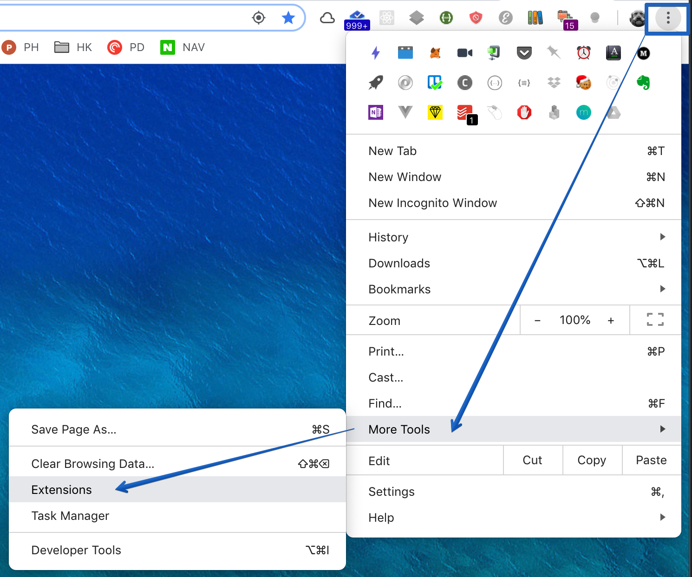
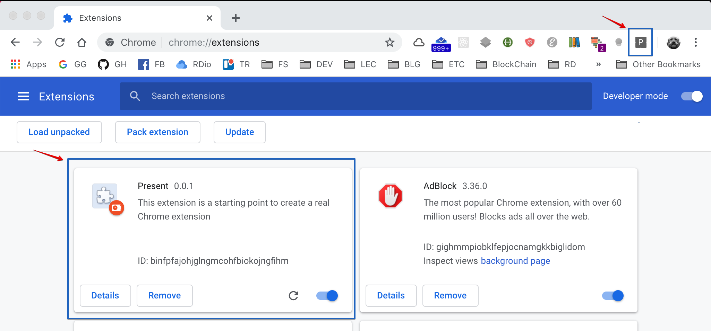

# IM09 2-week project : Client Repository

## How to use release package

1. Download release (compressed build folder).
2. Uncompress it.
3. Click Chrome right top three icons > More Tools > Extensions

4.Check install present app.

## Release History

### Dec.13.2018

[Releases · codestates/im09-2018-11-prj-present-client](https://github.com/codestates/im09-2018-11-prj-present-client/releases)
